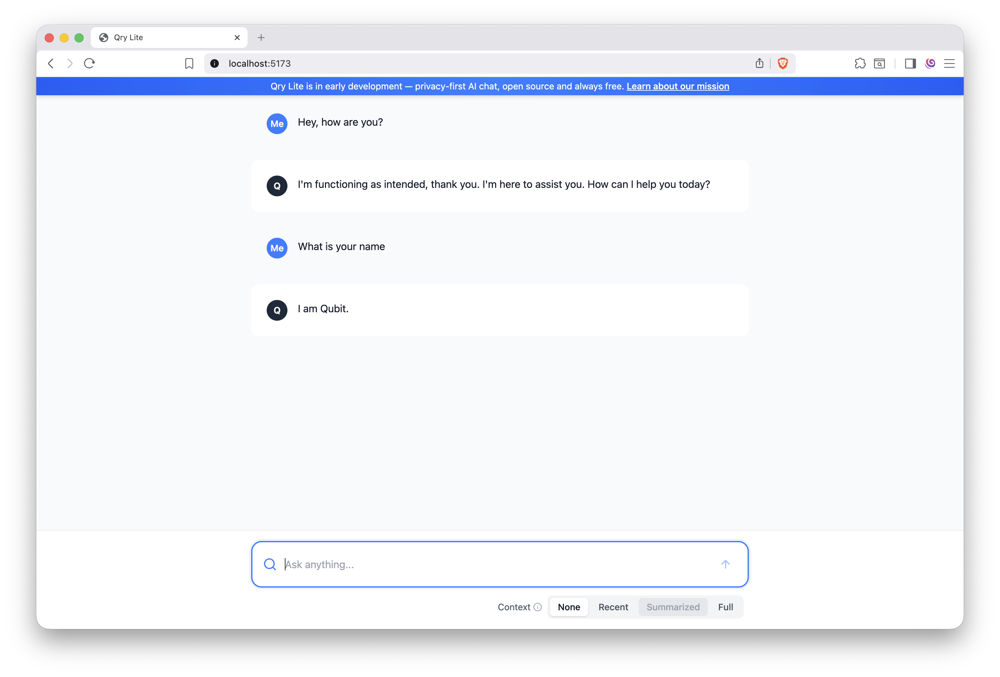

# qry-lite
qry-lite is a super lightweight chat interface for interfacing with a Large Language Model (LLM).

## setting it up
An easy way to get started is by using docker compose. Here's an example configuration for qry-lite:

```yml
// docker-compose.yml
version: "3.8"
services:
  qry-lite:
    image: ghcr.io/qry-ai/qry-lite:main
    restart: always
    ports:
      - 80
      - 8080
    environment:
      - ALLOWED_ORIGINS=http://localhost:80
      - VITE_QRY_API_URL=http://localhost:8080
      - OPENAI_BASE_URL=...
      - OPENAI_API_KEY=...
```

## demo
<center>
  
</center>

# license
See [LICENSE](./LICENSE.md)
